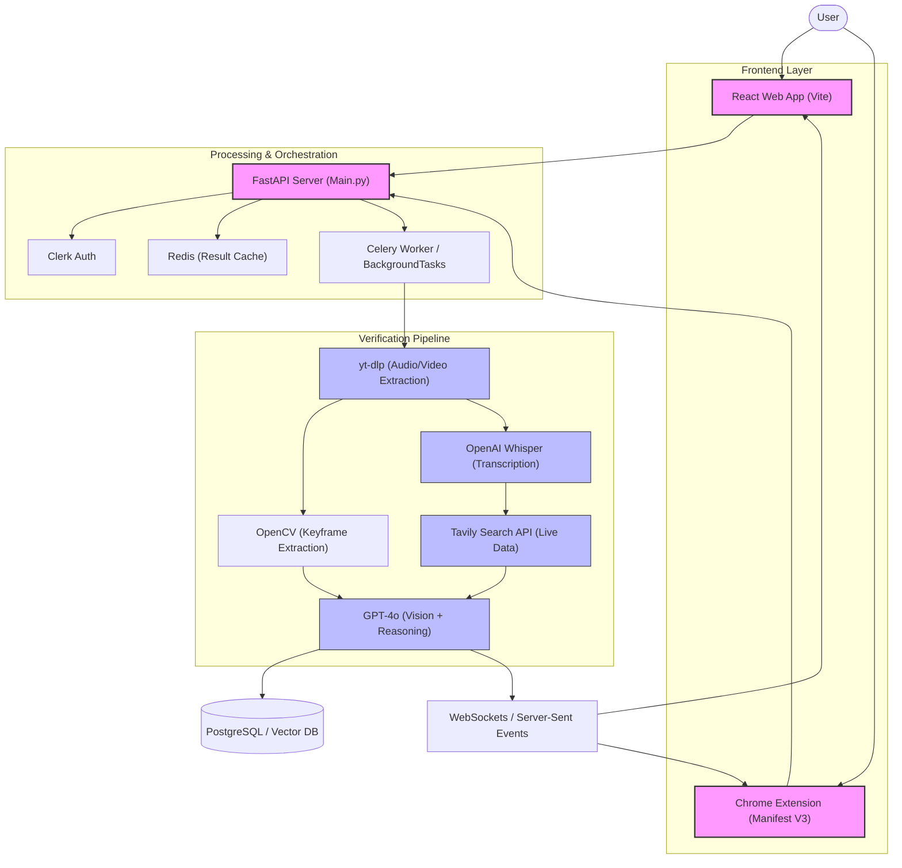

**TEAM NAME - NULL-POINTERS
PROJECT NAME- FACTIFY AI : TECHNICAL ROADMAP & IMPLEMENTATION GUIDE**

# Factify AI: Technical Roadmap & Implementation Guide

This project is an AI-powered video verification engine. Below is the technical plan for implementing the next phase of features.

---

## 🚩 Problem Statement
1.  **Information Overload & Misinformation**: Rapid sharing of video content on platforms like YouTube and Instagram makes manual fact-checking of countless claims impossible for humans in real-time.
2.  **Opaque Verification Complexity**: Extracting, translating, and cross-referencing audio and visual evidence from video is technically prohibitive for the average viewer, allowing misinformation to spread unchecked.
3.  **Static Knowledge Gap**: Traditional AI models rely on static training data, failing to verify "breaking news" or current events where viral misinformation is most active.

## 💡 Proposed Solution
1.  **Automated Multi-Modal Pipeline**: Leveraging `yt-dlp`, Whisper, and GPT-4o to automatically extract, transcribe, and analyze video content at scale, eliminating the manual verification burden.
2.  **Real-Time Truth Discovery**: Integrating live web search (Tavily/Perplexity) to bridge the LLM knowledge gap, enabling accurate verification of today’s events and breaking news.
3.  **Frictionless Verifiability**: Delivering structured fact-check reports with direct source citations via a browser extension, empowering users to verify claims directly on the platforms where they consume content.

---

## 🚀 Core Features

### ✅ Currently Implemented
*   **Video-to-Audio Extraction**: Powered by `yt-dlp` to pull high-quality audio from any YouTube or Instagram URL.
*   **AI Transcription**: Uses OpenAI **Whisper** to convert spoken audio into precise text.
*   **Global Translation**: Automatically detects and translates non-English content into English for verification.
*   **The "Verifier" Agent**: A specialized GPT-4o persona that identifies factual claims and scores them (Yes/No/Half).
*   **Simple Web Dashboard**: A clean React-based interface for content submission and report viewing.

### 🛠️ In Development (Roadmap)
*   **Real-Time Web Search**: Integration with Tavily/Perplexity to verify today's breaking news.
*   **Vision RAG**: Analyzing video keyframes with GPT-4o Vision to catch visual deception.
*   **Source Citation**: Direct web links in every report to provide evidence for the verification result.
*   **Browser Extension**: A Chrome/Edge extension for one-click verification directly on social feeds.
*   **Async Processing**: Support for long-form videos (30m+) via background task queuing.

---

## ⭐ Core Benefits
1.  **Combats Real-Time Misinformation**: Integrates live web search to verify "breaking news" and current events that traditional LLMs would miss due to their knowledge cut-offs.
2.  **Massive Effort Reduction**: Automates the tedious work of downloading, transcribing, translating, and cross-referencing claims from videos, turning hours of research into seconds.
3.  **Enhanced Visual Integrity**: Leverages Vision-based analysis to detect deceptive editing or charts that might contradict the spoken audio claims.
4.  **Evidence-Backed Transparency**: Provides users with clear reasoning and direct links to reputable sources, building trust and encouraging independent verification.
5.  **Seamless Integration**: With a browser extension, it brings fact-checking directly to the source (YouTube, Instagram), making truth-seeking a natural part of content consumption.

---

## 💎 What Makes Factify AI Unique?

Unlike standard fact-checkers or generic AI chatbots, Factify AI is built specifically for the **modern video-first internet**:

*   **Multimodal Cross-Verification**: We don't just listen to the audio; we watch the video. By combining **Whisper (Audio)** and **GPT-4o Vision (Visuals)**, we catch discrepancies where visual aids are used to mislead.
*   **The "Now" Engine**: Most LLMs are stuck in the past. Our integration with **Real-time Search APIs** allows us to verify claims that happened only minutes ago, bridging the critical knowledge-gap.
*   **Contextual Fraud Detection**: Our specialized **"Verifier" System Prompt** is trained to distinguish between casual conversation, personal opinion, and verifiable factual claims.
*   **Zero-Friction Access**: By bringing the verification engine directly to the source (YouTube/Instagram) via a **Browser Extension**, we eliminate the need for users to copy-paste URLs or open new tabs.
*   **Universal Language Support**: Our automated translation layer ensures that viral content in any language can be fact-checked against global databases instantly.

---

## 🏗️ Detailed Architecture



---

## 🚀 Feature Implementation Details

### 1. Real-time Web Search (Truth Discovery)
To verify claims that are more recent than the LLM's training data.
*   **API**: [Tavily AI](https://tavily.com/) or [Perplexity API](https://www.perplexity.ai/hub/blog/introducing-pplx-api).
*   **Implementation**:
    1.  Extract "Named Entities" and "Claims" from the transcript.
    2.  Construct search queries (e.g., `"Is [Claim] true? news 2024"`).
    3.  Feed the search results into the final GPT-4o prompt context.

### 2. Vision RAG (Visual Evidence Verification)
To detect if the video visuals match the audio claims.
*   **Tools**: `OpenCV` (Python) or `FFmpeg`.
*   **Implementation**:
    1.  Extract keyframes every 5 seconds.
    2.  Convert frames to Base64.
    3.  Pass frames + transcript snippets to `gpt-4o` with a prompt: *"Does the visual content support or contradict the claim: '[Claim]'?"*

### 3. Source Attribution (Credibility Links)
Providing evidence links for every verification result.
*   **Implementation**:
    1.  Instruct the LLM to return a list of URLs used during the Search step.
    2.  Update the `VerificationResult` schema:
        ```json
        {
          "isContentCorrect": "No",
          "sources": [
            {"title": "WHO Report 2024", "url": "https://who.int/..."},
            {"title": "BBC News", "url": "https://bbc.com/..."}
          ]
        }
        ```

### 4. Async Processing (Scaling & Stability)
Handling long-form content (30 min+ videos) without timing out the HTTP request.
*   **Stack**: `Redis` + `Celery` (or FastAPI `BackgroundTasks` for simpler load).
*   **Flow**:
    1.  User submits URL -> API returns `202 Accepted` with a `job_id`.
    2.  Backend processes in the background.
    3.  Frontend polls `/status/{job_id}` or listens via WebSockets.

### 5. Browser Extension (Seamless UX)
Fact-checking directly on social platforms.
*   **Tech**: Manifest V3, React.
*   **Implementation**:
    1.  **Content Script**: Injects a "Verify with Factify" button next to the YouTube channel name or Instagram post.
    2.  **Popup**: Shows the verification progress and final result without leaving the page.

---

## 🛠️ Required Dependencies
Add these to `requirements.txt`:
```text
tavily-python          # For real-time search
opencv-python-headless # For frame extraction
redis                  # For async task queuing
celery                 # For background workers
```
